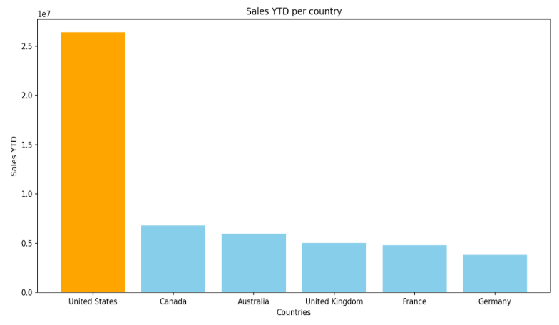
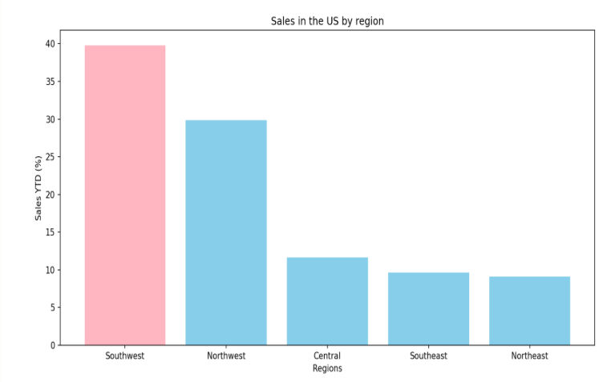
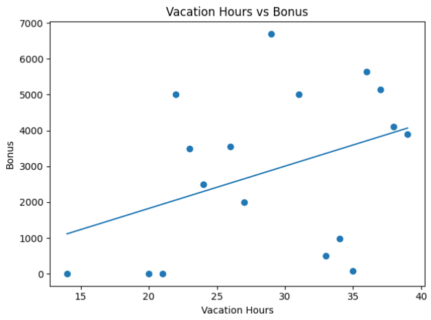
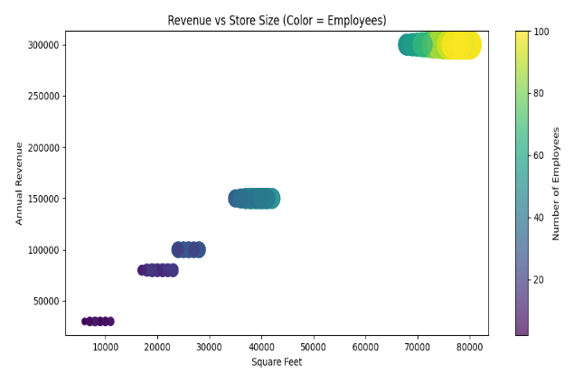

# Retail Performance & Workforce Efficiency Analysis

A portfolio-ready SQL + Python case study built on the AdventureWorks2019 dataset.

## Overview

This project analyses retail performance and workforce efficiency using AdventureWorks2019. It focuses on revenue concentration, regional performance, employee-related patterns, and store-level drivers of revenue.

The goal is to answer practical business questions with clear SQL queries, clean Python visualisations, and decision-oriented recommendations.

## Why this project matters

Many student projects stop at charts. This one is structured like an analyst portfolio piece:

- business-first questions
- reproducible SQL analysis
- Python-based visualisation
- clear executive summary
- actionable recommendations

## Business Questions

1. Which countries generate the highest revenue?
2. What are the regional sales patterns in the best-performing country?
3. Is there a relationship between vacation hours and bonus?
4. Does sick leave vary by job title or department?
5. Does store age predict revenue?
6. How do store size and number of employees relate to revenue?

## Executive Summary

- The **United States** is the top-performing country by revenue.
- Within the US, the **Southwest** region contributes the largest share of sales.
- **Vacation hours and bonus** show a weak relationship, suggesting benefits are not strongly tied to sales incentives.
- **Sick leave differs by department**, but not in a way that clearly tracks seniority.
- **Store age alone does not explain revenue**; newer stores can outperform older ones.
- **Store size and employee count correlate positively with revenue**, but similarly sized stores can still perform very differently, indicating that execution matters.

## Business Recommendations

- Prioritise expansion and deeper analysis in high-performing US regions.
- Investigate top-performing stores to identify repeatable drivers of success.
- Review staffing efficiency rather than assuming larger stores always perform better.
- Reassess incentive structures if the business wants compensation to align more closely with performance.
- Explore operational factors beyond size and tenure, such as location quality, staffing mix, and management effectiveness.

## Tech Stack

- **SQL Server / SSMS**
- **Python**
  - pandas
  - numpy
  - matplotlib
- **AdventureWorks2019**


## 📊 Visualisations

### 🌍 Sales by Country (US dominates revenue)


### 🇺🇸 US Regional Sales (Southwest strongest)


### 💰 Vacation vs Bonus (weak correlation)


### 🏬 Store Size vs Revenue (scale vs performance)



## Repository Structure

```text
adventureworks-retail-analysis/
├── README.md
├── LICENSE
├── .gitignore
├── requirements.txt
├── data/
│   └── DATASET_SETUP.md
├── docs/
│   └── references/
│       ├── Group 2 Interim Project.docx
│       └── Group 2 Interim Project Presentation.pptx
├── sql/
│   ├── 01_revenue_by_country.sql
│   ├── 02_us_regional_sales.sql
│   ├── 03_vacation_vs_bonus.sql
│   ├── 04_sick_leave_analysis.sql
│   ├── 05_store_duration_vs_revenue.sql
│   └── 06_store_size_employees_revenue.sql
├── python/
│   ├── 01_sales_by_country.py
│   ├── 02_us_regional_sales.py
│   ├── 03_vacation_vs_bonus.py
│   ├── 04_sick_leave_by_department.py
│   ├── 05_store_duration_vs_revenue.py
│   └── 06_store_size_employees_revenue.py
└── images/
```

## How to use this project

1. Restore the AdventureWorks2019 database backup locally in SQL Server.
2. Run the SQL scripts in the `sql/` folder.
3. Export query outputs to CSV files.
4. Update file paths inside the Python scripts if needed.
5. Run the Python scripts to reproduce the visualisations.

## Notes

- The original `.bak` database backup is **not included in this GitHub-ready repo zip** because it is too large for a normal GitHub repository workflow.
- The original project report and slide deck are included in `docs/references/`.
- This repo is designed to present the work professionally for recruiters and hiring managers.


## Author

**Hasan Naimul**  
Aspiring Data Analyst

## License

This project is released under the MIT License.
